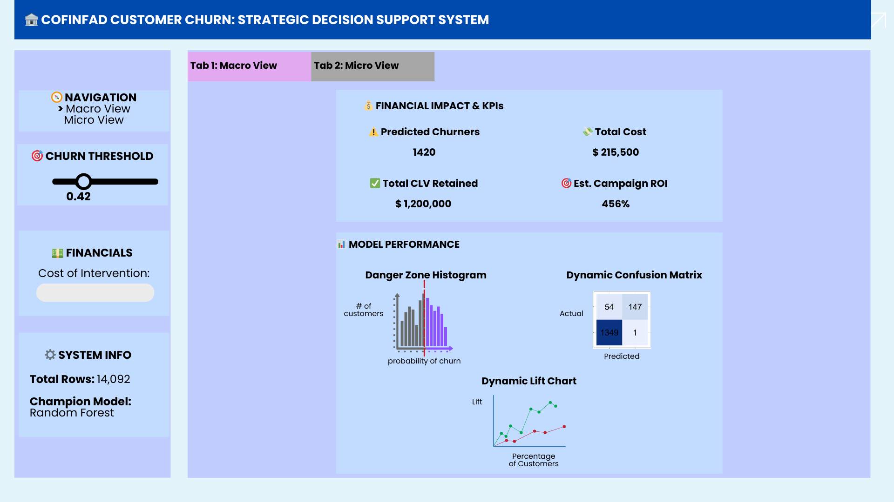
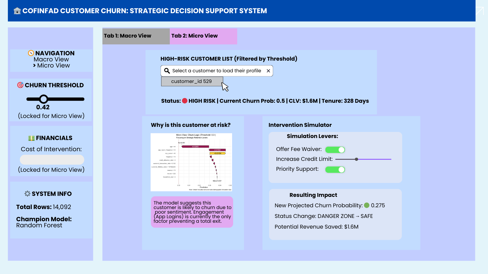

# Predictive Modelling

## 1 Overview

This project aims to develop a robust predictive model to identify customer churn within a Colombian fintech environment. Using the **COFINFAD** dataset, which tracks the behavior of 48,723 customers over the 2023 calendar year, the analysis bridges the gap between customer sentiment and actual transactional behavior. By converting over 3.1 million raw transaction logs into actionable behavioral metrics, the project provides a data-driven strategy for proactive customer retention.

## 2 Install and Load Packages

In this project, we utilize eighteen R packages to facilitate data import, manipulation, and advanced visualization:

-   **`tidyverse`**: A collection of fundamental R packages designed for data science, covering everything from data cleaning to creating static statistical graphs.

-   **`naniar`**: Provides a suite of functions to tidy, visualize, and analyze **missing data** (NAs)

-   **`skimr`**: A tool for **quick data assessment**. It produces a "skim" of a dataframe, providing summary statistics (mean, SD, quantiles) and tiny inline histograms (sparklines) for a fast overview of distributions.

-   **`knitr`**: The engine behind **dynamic report generation** in R. It integrates R code into Markdown, LaTeX, or HTML documents, allowing you to "knit" your analysis into a finished report.

-   **`dplyr`**: It's the package for **filtering, selecting, mutating, and summarizing** dataframes using a clean, readable syntax.

-   **`kableExtra`**: An extension for `knitr::kable()` that provides advanced styling options for **HTML and PDF tables**, such as striped rows, hover effects, and complex headers.

-   **`patchwork`**: Makes **combining multiple ggplots** incredibly simple.

-   **`corrplot`**: A graphical display of a **correlation matrix**. It helps you quickly identify patterns and strengths of relationships between variables using colors and shapes.

-   **`tidymodels`**: A "meta-package" (like the tidyverse) designed for **modeling and machine learning**. It provides a consistent framework for preprocessing, training, and validating models.

-   **`ranger`**: A fast implementation of **Random Forests**. It is highly memory-efficient and particularly well-suited for high-dimensional data.

-   **`xgboost`**: An interface for **Extreme Gradient Boosting**. It’s a powerful, scalable library used for gradient-boosted decision trees, often favored in data science competitions for its speed and performance.

-   **`vip`**: Stands for **Variable Importance Plots**. It extracts and visualizes the importance of features in various machine learning models, helping you understand which variables are driving your model's predictions.

-   **`car`**: provides advanced statistical tests and diagnostic tools—such as the `vif()` function—to evaluate, troubleshoot, and refine regression models.

-   **`rsample`**: provides the tools to split your data into training and testing sets, as well as create resampled data like cross-validation folds.

-   **`tune`**: helps optimize your machine learning models by testing and finding the best possible hyperparameter values.

-   **`parsnip`**: gives a single, standardized interface to build and fit various types of machine learning models

-   **`workflows`**: simplifies your coding pipeline by bundling your data pre-processing steps and the `parsnip` model into one cohesive object that can be trained and tested together.

-   **`yardstick`**: provides a consistent, tidy interface for calculating model performance metrics

```{r}
pacman::p_load(tidyverse, naniar, skimr, knitr, dplyr,kableExtra, patchwork, corrplot, tidymodels,ranger, xgboost,vip,car, rsample, tune, parsnip, workflows, yardstick)
```

## 3 Data Preparation

### 3.1 The Data

This project analyzes the [Colombian Fintech Financial Analytics Dataset](https://data.mendeley.com/datasets/mhb4zn3258/1) (COFINFAD). The dataset contains behavioral and transactional records for 48,723 customers, collected over a 12-month period from January 4 to December 29, 2023. Comprising over 3.1 million individual transactions, the data is designed to support research on customer retention, financial behavior, and digital service adoption in emerging Latin American markets.

The dataset consists of two CSV files:

-   **`transactions_data.csv`**: Transaction-level data (3,159,157 rows), where each row represents a single transaction.

-   **`customer_data.csv`**: Customer-level data (48,723 rows), including demographics, product portfolios, satisfaction metrics, and aggregated behavioral features.

### 3.2 Import Data

The following code chunk utilizes the **`read_csv()`** function from the **`readr`** package (part of the **tidyverse**) to import the datasets into the R environment.

```{r}
customer_data <- read_csv("data/customer_data.csv")
transactions_data <- read_csv("data/transactions_data.csv")
```

### 3.3 Preparing the Data

#### 3.3.1 Check Missing Values

I use `gg_miss_var(customer_data)` to get an instant, clear picture of **which columns in the dataset are missing the most information**. Instead of scrolling through a massive table of `NA` counts, this function (from the `naniar` package) generates a simple bar chart.

::: panel-tabset
## Plot

```{r, echo=FALSE}
# Visualize missingness in customer data
gg_miss_var(customer_data)
```

## Code

```{r, eval=FALSE}
# Visualize missingness in customer data
gg_miss_var(customer_data)
```
:::

In the customer dataset ($N = 48,723$), missing values are limited to `complaint_topics` (49.97%), `credit_utilization_ratio` (37.48%), and `feature_requests` (33.07%). These gaps are structural, occurring when a product or interaction is not applicable to the customer. Categorical missing values were imputed as 'None' or 'No Interaction'. For `credit_utilization_ratio`, NAs were filled with 0.

```{r}
customer_data_clean <- customer_data %>%
  mutate(
    # 1. Impute numerical data with 0 
    credit_utilization_ratio = replace_na(credit_utilization_ratio, 0),
    
    # 2. Impute categorical data with 'None' and 'No Interaction'
    complaint_topics = replace_na(complaint_topics, "None"),
    feature_requests = replace_na(feature_requests, "No Interaction"),
  )
```

```{r}
# Visualize missingness in transaction data
gg_miss_var(transactions_data)
```

All transaction-level variables are complete.

#### 3.3.2 Data Wrangling

##### 3.3.2.1 Recency, Frequency, and Monetary

To enhance the predictive power of the model, I will perform feature engineering on the `transactions_data.csv` to derive the **RFM** (Recency, Frequency, and Monetary) metrics for each of the 48,723 customers. These features are essential for capturing dynamic behavioral patterns that static demographic data may miss.

-   **Recency**: Calculated as the number of days between the customer's last transaction and the reference date of **December 30, 2023**.

-   **Frequency**: The total number of transactions recorded for each customer throughout the 12-month period.

-   **Monetary**: The total value of all transactions in Colombian Pesos (COP) for each individual customer.

By aggregating over 3.1 million transaction-level rows into these three customer-level dimensions, I can better identify high-value loyalists and distinguish them from at-risk users, providing a more robust foundation for churn prediction.

```{r}
# Set the reference date (one day after the last transaction in the dataset)
reference_date <- as.Date("2023-12-30")

# Calculate RFM metrics from transactions_data
rfm_features <- transactions_data %>%
  # Ensure the date column is in the correct Date format
  mutate(date = as.Date(date)) %>%
  group_by(customer_id) %>%
  summarise(
    # Recency: Days since the last transaction
    recency = as.numeric(reference_date - max(date)),
    
    # Frequency: Total count of transactions
    frequency = n(),
    
    # Monetary: Total sum of transaction amounts (in COP)
    monetary = sum(amount, na.rm = TRUE)
  )
```

##### 3.3.2.2 Merge RFM features with cleaned customer dataset

```{r}
# Merge RFM features with your cleaned customer dataset
customer_data_final <- customer_data_clean %>%
  left_join(rfm_features, by = "customer_id")
```

```{r}
# Visualize missingness in customer data
gg_miss_var(customer_data_final)
```

Every customer has a Recency, Frequency, and Monetary value.

##### 3.3.2.3 Statistical Summary of Data

I use `skim()` because standard functions like `summary()` or `str()` become an unreadable wall of text when we have 57 variables.

Here is exactly why it is the most efficient choice for a wide dataset:

-   **Instant Organization:** It automatically groups the 57 variables by data type (numeric, character, factor, etc.) into clean, separate tables, making the output much easier to navigate.

-   **Inline Distributions:** For numeric data, it generates tiny inline histograms (sparklines) directly in the console. This lets us spot skewed distributions, outliers, or weird patterns at a glance without having to plot dozens of individual charts.

```{r}
customer_data_final %>% 
  skim()
```

## 4 Analytical Workflow

The analytical workflow follows a systematic pipeline: initial **feature engineering** and **variable selection** to refine the high-dimensional dataset, followed by **univariate distribution analysis** to identify outliers. A **correlation matrix** is then utilized to detect initial pairwise multi-collinearity among the behavioral metrics. The data is subsequently partitioned through **random sampling** into training and testing sets. Finally, a **Variance Inflation Factor (VIF)** assessment is applied strictly to the training data to detect and eliminate any remaining multivariate collinearity before the **predictive models** are developed.

### 4.1 Feature Engineering and Variable Selection

To enhance model parsimony and mitigate the risks associated with high cardinality, categorical variables—specifically **location**, **occupation**, and **feature_requests**—were subjected to frequency-based lumping. Utilizing the `fct_lump_n` function, the feature space for each variable was condensed to preserve only the five most frequent levels, with all remaining infrequent categories consolidated into a standardized 'Other' designation.

```{r}
# Applying lumping to location, occupation, and feature_requests
modeling_data <- customer_data_final %>%
  mutate(
    # Preserve top 5 most frequent locations
    location = fct_lump_n(as.factor(location), n = 5, other_level = "Other"),
    
    # Preserve top 5 most frequent occupations
    occupation = fct_lump_n(as.factor(occupation), n = 5, other_level = "Other"),
    
    # Preserve top 5 feature requests
    feature_requests = fct_lump_n(as.factor(feature_requests), n = 5, other_level = "Other")
  )
```

To account for the duration of the customer relationship, a **Tenure** variable was engineered by calculating the chronological distance between each customer's `first_transaction_date` and the study's reference date of December 30, 2023. In contrast to the provided `customer_tenure` variable, which is measured in months, this daily calculation offers a high-granularity perspective on the customer lifecycle. This enables the model to more accurately identify churn risks within critical windows, such as the early onboarding phase or the transition into long-term loyalty."

```{r}
# Reference date based on the 2023 dataset cutoff
ref_date <- as.Date("2023-12-30")

modeling_data <- modeling_data %>%
  mutate(
    # Ensure first_transaction_date is in Date format
    first_transaction_date = as.Date(first_transaction_date),
    
    # Calculate Tenure in days
    tenure = as.numeric(ref_date - first_transaction_date)
  )
```

Prior to model training, a rigorous feature selection process was conducted to ensure model parsimony and prevent multicollinearity. The following table details the variables excluded from the final dataset, along with the specific technical or behavioral justification for their removal.

```{r}
#| label: tbl-excluded
#| tbl-cap: "Summary of Excluded Variables and Rationalization"
#| code-fold: true
#| code-summary: "Show the R code used to generate this table"

excluded_vars <- data.frame(
  Variable = c(
    "customer_id", 
    "last_tx / last_transaction_date", 
    "first_tx / first_transaction_date",
    "last_survey_date",
    "satisfaction_score",
    "avg_tx_value",
    "monthly_transaction_count",
    "average_transaction_value",
    "tx_count",
    "total_tx_volume",
    "total_transaction_volume",
    "transaction_frequency",
    "avg_daily_transactions",
    "customer_tenure",
    "clv_segment"
  ),
  Reason_for_Exclusion = c(
    "Zero predictive power; random identifier with no relationship to financial behavior.",
    "Redundant; information captured by the engineered 'Recency' feature.",
    "Redundant; information captured by the engineered 'Tenure' feature.",
    "Sentiment signal is better captured by satisfaction pillars or NPS; dates are less predictive than scores.",
    "Excluded to prioritize model interpretability; specific pillars (base, tx, product) provide more actionable insights.",
    "High multicollinearity with total_tx_volume.",
    "High multicollinearity with tx_count.",
    "Redundant; mathematically derived from monetary and frequency.",
    "Redundant; information captured by the engineered 'frequency' feature.",
    "Redundant; information captured by the engineered 'monetary' feature.",
    "Data inconsistency; shares a definition with total_tx_volume but contains significant system noise.",
    "High correlation with frequency.",
    "Perfectly correlated with frequency (mathematical derivative).",
    "Redundant; information captured by the higher-granularity 'Tenure' (days) feature.",
    "Categorical derivative of customer_lifetime_value; removed to preserve raw numeric granularity for the model."
  )
)

# Render the table
library(kableExtra)
kable(excluded_vars, 
      col.names = c("Variable", "Rationale for Exclusion")) %>%
  kable_styling(bootstrap_options = c("striped", "hover", "condensed"), 
                full_width = F) %>%
  column_spec(1, bold = T, border_right = T) %>%
  column_spec(2, width = "35em")
```

```{r}
# Finalizing the modeling dataset by excluding 17 redundant or low-predictive variables
modeling_data <- modeling_data %>%
  select(
    -customer_id,
    -last_tx, -last_transaction_date,
    -first_tx, -first_transaction_date,
    -last_survey_date,
    -satisfaction_score,            
    -avg_tx_value,
    -monthly_transaction_count,
    -average_transaction_value,
    -tx_count,
    -total_tx_volume,
    -total_transaction_volume,
    -transaction_frequency,
    -avg_daily_transactions,
    -customer_tenure,
    -clv_segment
  )
```

### 4.2 Univariate distribution Analysis

#### 4.2.1 Distribution of Target Variable

Combining a histogram with a density curve provides the most comprehensive view of the overall distribution for the `churn_probability`. The histogram reveals the granular details and exact data bins, highlighting specific spikes or gaps in the actual risk scores. Meanwhile, the overlaid density curve smooths out this noise, allowing us to instantly identify the overarching shape and trends of the customer baseline risk.

::: panel-tabset
## Plot

```{r, echo=FALSE}
ggplot(modeling_data, aes(x = churn_probability)) +
  geom_histogram(aes(y = ..density..), bins = 30, fill = "skyblue", color = "white") +
  geom_density(alpha = 0.2, fill = "blue") +
  theme_minimal() +
  labs(
    title = "Univariate Distribution of Churn Probability",
    subtitle = "Understanding the baseline risk across the customer base",
    x = "Churn Probability (0 to 1)",
    y = "Density"
  )
```

## Code

```{r, eval=FALSE}
ggplot(modeling_data, aes(x = churn_probability)) +
  geom_histogram(aes(y = ..density..), bins = 30, fill = "skyblue", color = "white") +
  geom_density(alpha = 0.2, fill = "blue") +
  theme_minimal() +
  labs(
    title = "Univariate Distribution of Churn Probability",
    subtitle = "Understanding the baseline risk across the customer base",
    x = "Churn Probability (0 to 1)",
    y = "Density"
  )
```
:::

```{r}
# Calculate specific risk tiers
risk_tiers <- quantile(modeling_data$churn_probability, probs = c(0.75, 0.90, 0.99))
print(risk_tiers)
```

The distribution of `churn_probability` is notably compressed, with a maximum value of **0.5006**. Because the vast majority of the population falls below the traditional **0.50** classification threshold, a standard binary approach would result in significant 'under-counting' of at-risk individuals. To address this, a **Relative Risk Framework** was adopted. The **75th percentile (0.3927)** was used to identify the transition into 'Medium Risk,' while the **90th percentile (0.4200)** was established as the operational threshold for 'High Risk' classification. This approach ensures the model identifies the most vulnerable **10%** of the customer base, providing actionable targets for the bank’s retention strategies by focusing on the highest relative risk.

```{r}
# Defining Risk Tiers based on calculated percentiles
modeling_data <- modeling_data %>%
  mutate(risk_group = case_when(
    churn_probability >= 0.4200 ~ "High Risk (>90th)",
    churn_probability >= 0.3927 ~ "Medium Risk (75th-90th)",
    TRUE ~ "Standard (<75th)"
  )) %>%
  # Ensuring factor levels are ordered for logical plotting
  mutate(risk_group = factor(risk_group, 
                             levels = c("Standard (<75th)", 
                                        "Medium Risk (75th-90th)", 
                                        "High Risk (>90th)")))
```

#### 4.2.2 Distribution of Numerical Variables

I used faceted boxplots to efficiently visualize the distribution and spread of all the numerical variables simultaneously, regardless of their differing scales. This visual approach allows us to instantly identify data anomalies, as it automatically isolates and flags potential outliers falling beyond 1.5 times the Interquartile Range (IQR) in red.

::: panel-tabset
## Plot

```{r, echo=FALSE}
#| fig-width: 14
#| fig-height: 18
#| label: fig-outlier-detection
#| fig-cap: "Outlier detection for all numerical features"


# Identify all numeric variables
numeric_cols <- modeling_data %>% 
  select(where(is.numeric)) %>% 
  colnames()

# Reshape data for a facet-grid boxplot
modeling_data %>%
  select(all_of(numeric_cols)) %>%
  pivot_longer(everything(), names_to = "variable", values_to = "value") %>%
  ggplot(aes(x = variable, y = value)) +
  geom_boxplot(fill = "steelblue", outlier.color = "red", outlier.shape = 1) +
  facet_wrap(~variable, scales = "free") + # 'free' is key because scales differ
  theme_minimal() +
  labs(title = "Outlier Detection Across Numerical Variables",
       subtitle = "Red dots indicate potential outliers beyond 1.5 * IQR") +
  theme(axis.text.x = element_blank()) 
```

## Code

```{r, eval=FALSE}

# Identify all numeric variables
numeric_cols <- modeling_data %>% 
  select(where(is.numeric)) %>% 
  colnames()

# Reshape data for a facet-grid boxplot
modeling_data %>%
  select(all_of(numeric_cols)) %>%
  pivot_longer(everything(), names_to = "variable", values_to = "value") %>%
  ggplot(aes(x = variable, y = value)) +
  geom_boxplot(fill = "steelblue", outlier.color = "red", outlier.shape = 1) +
  facet_wrap(~variable, scales = "free") + # 'free' is key because scales differ
  theme_minimal() +
  labs(title = "Outlier Detection Across Numerical Variables",
       subtitle = "Red dots indicate potential outliers beyond 1.5 * IQR") +
  theme(axis.text.x = element_blank()) 
```
:::

To balance model stability with data preservation, **Winsorization** was applied to the behavioral features **monetary**, **frequency**, and **customer_lifetime_value**. Rather than excluding these high-value data points, extreme outliers were capped at the **99th percentile**. This approach mitigates the influence of extreme variance on tree-splitting algorithms while ensuring that the predictive model retains critical insights from the bank’s most significant customer segments, leading to more robust and generalizable results.

```{r}
# Finalizing the Behavioral Features
vars_to_cap <- c("monetary", "frequency", "customer_lifetime_value")

modeling_data <- modeling_data %>%
  mutate(across(all_of(vars_to_cap), ~ {
    upper_limit <- quantile(.x, 0.99, na.rm = TRUE)
    ifelse(.x > upper_limit, upper_limit, .x)
  }))

```

### 4.3 Correlation Matrix

I use `corrplot` to instantly visualize the strength and direction of relationships between all the numeric variables, making it easy to spot potential multicollinearity before modeling. By using hierarchical clustering (`order = "hclust"`), the plot automatically groups highly correlated variables together so patterns stand out naturally. Furthermore, overlaying the exact numbers (`addCoef.col`) gives us the precise correlation coefficients alongside the color-coded heatmap, providing both a big-picture summary and granular detail in a single chart.

::: panel-tabset
## Plot

```{r, echo=FALSE}
# 1. Isolate numeric variables 
numeric_vars <- modeling_data %>% 
  select(where(is.numeric))

# 2. Compute the matrix
cor_matrix <- cor(numeric_vars, use = "pairwise.complete.obs")

# 3. Render with Numbers
corrplot(cor_matrix, 
         method = "color", 
         type = "upper", 
         order = "hclust", 
         addCoef.col = "black", # This adds the correlation numbers
         number.cex = 0.4,      # Crucial: tiny font so 42x42 numbers fit
         tl.col = "black", 
         tl.srt = 45, 
         tl.cex = 0.5, 
         diag = FALSE, 
         title = "\n\nCorrelation Matrix with Coefficients",
         mar = c(0,0,3,0))
```

## Code

```{r, eval=FALSE}
# 1. Isolate numeric variables 
numeric_vars <- modeling_data %>% 
  select(where(is.numeric))

# 2. Compute the matrix
cor_matrix <- cor(numeric_vars, use = "pairwise.complete.obs")

# 3. Render with Numbers
corrplot(cor_matrix, 
         method = "color", 
         type = "upper", 
         order = "hclust", 
         addCoef.col = "black", # This adds the correlation numbers
         number.cex = 0.4,      # Crucial: tiny font so 42x42 numbers fit
         tl.col = "black", 
         tl.srt = 45, 
         tl.cex = 0.5, 
         diag = FALSE, 
         title = "\n\nCorrelation Matrix with Coefficients",
         mar = c(0,0,3,0))
```
:::

The feature set was refined to ensure model integrity and transition from descriptive to predictive analysis. `monetary` and `base_satisfaction` were removed to resolve multicollinearity, as they were highly redundant with `customer_lifetime_value` ($r = 0.96$) and `nps_score` ($r = 0.78$), respectively. Additionally, `risk_group` and `active_products` were excluded to eliminate data leakage. Because `active_products` acted as a lagging mathematical proxy for the target ($r = -0.88$), its removal forced the model to rely on proactive behavioral signals—such as app engagement and sentiment—that allow for genuine early intervention.

```{r}
# Finalizing the features by removing leaky and redundant variables
modeling_data_final <- modeling_data %>%
  select(
    -monetary,        # Removed due to high multicollinearity (r = 0.96) with CLV
    -risk_group,      # Removed to prevent leakage (directly derived from target)
    -active_products,  # Removed as a lagging indicator (r = -0.88 with target)
    -base_satisfaction   # Redundant with nps_score (r = 0.78)
  )
```

```{r, eval=FALSE}
# List final column names 
colnames(modeling_data_final)
```

<details>

<summary>Click to reveal final column names</summary>

```{r, echo=FALSE}
# List final column names 
colnames(modeling_data_final)
```

</details>

### 4.4 Stratified Random Sampling

To evaluate model performance and generalizability, the finalized dataset was partitioned using **stratified random sampling**. An **80/20 split** was implemented, resulting in a training set of approximately 39,000 observations and a holdout testing set of 9,700 observations. Stratification was applied to the `churn_probability` target to ensure that both subsets maintained an identical risk distribution, providing a robust foundation for the subsequent training phase.

```{r}
# Set seed for reproducibility (so you get the same 'random' split every time)
set.seed(123)

# Create the split (80% Training, 20% Testing)
# We stratify by churn_probability to keep the risk distribution consistent
data_split <- initial_split(modeling_data_final, 
                           prop = 0.80, 
                           strata = churn_probability)

# 3. Extract the sets
train_data <- training(data_split)
test_data  <- testing(data_split)

# 4. Verify the split sizes
nrow(train_data) 
nrow(test_data)  
```

### 4.5 Variance Inflation Factor (VIF)

```{r,eval=FALSE}
my_model <- lm(churn_probability ~ ., data = train_data)

# This will show you the exact variables that are perfectly correlated
alias(my_model)
```

<details>

<summary>Click to reveal *Perfect* Multicollinearity</summary>

```{r, echo=FALSE}
my_model <- lm(churn_probability ~ ., data = train_data)
alias(my_model)
```

</details>

```{r, eval=FALSE}
# Fits the model without the redundant average column
my_model_fixed <- lm(churn_probability ~ . - product_satisfaction, data = train_data)
# Calculate VIF
vif(my_model_fixed)
```

<details>

<summary>Click to reveal *VIF* result</summary>

```{r, echo=FALSE}
# Fits the model without the redundant average column
my_model_fixed <- lm(churn_probability ~ . - product_satisfaction, data = train_data)
# Calculate VIF
vif(my_model_fixed)

```

</details>

```{r}
# Remove the variables from the training data
train_data <- train_data %>%
  select(-product_satisfaction, -tx_satisfaction)

# Remove the EXACT SAME variables from the testing data
test_data <- test_data %>%
  select(-product_satisfaction, -tx_satisfaction)
```

::: callout-note
# Remove perfect/high multicollinearity variables

During the multicollinearity assessment on the training set, `product_satisfaction` was identified as having perfect multicollinearity (aliased), as it was an exact linear combination of the five individual banking product indicators. Consequently, it was removed to prevent information redundancy and distortion of feature importance. Subsequently, a Variance Inflation Factor (VIF) analysis was conducted, revealing that `tx_satisfaction` exceeded the conservative threshold of 5.0 (VIF = 5.21). To ensure strict model stability and maintain highly interpretable feature importance rankings for the final tree-based models (Random Forest and XGBoost), `tx_satisfaction` was also eliminated. To maintain feature alignment for model evaluation, these removals were identically applied to the testing dataset.
:::

## 5 Building Predictive Models

For the predictive modeling phase, **Random Forest** and **XGBoost** were selected due to their superior ability to handle the non-linear relationships and complex feature interactions inherent in banking behavioral data. Random Forest provides a robust, ensemble-based baseline that reduces variance by averaging multiple decision trees, making it highly resistant to overfitting. In contrast, XGBoost (Extreme Gradient Boosting) was chosen for its iterative optimization process, which minimizes residual errors and typically yields higher precision in identifying subtle churn signals. Both models are natively capable of handling the mixed data types in this study—ranging from categorical sentiment scores to capped financial metrics—without requiring the strict linearity assumptions of traditional regression models.

### 5.1 Create the Preprocessing Recipe

This recipe will automatically clean the data for both models. Since we have categorical variables like `gender` and `occupation`, we must convert them into a numeric format (Dummy Encoding).

```{r}
# Building the recipe
churn_recipe <- recipe(churn_probability ~ ., data = train_data) %>%
# Force logical/character columns to factors so they can be 'dummified'
  step_mutate_at(all_nominal_predictors(), all_logical_predictors(), fn = as.factor) %>%
  # Create 0/1 numeric columns for all categorical/logical features
  step_dummy(all_nominal_predictors()) %>%
  # Remove variables with zero variance
  step_zv(all_predictors()) %>%
  # Normalize all numbers (optional but good practice)
  step_normalize(all_numeric_predictors())
```

### 5.2 Tune and Fit the Models

#### 5.2.1 The Tuning Phase

##### 5.2.1.1 Set Up Cross-Validation Folds

Instead of training on the entire dataset at once, cross-validation splits training data into multiple "folds." The model trains on a subset and evaluates on the holdout fold, repeating this process to ensure it generalizes well to unseen data.

```{r}
# Create 5 folds for cross-validation 
set.seed(123) # For reproducibility
churn_folds <- vfold_cv(train_data, v = 5)
```

##### 5.2.1.2 Tag Hyperparameters for Tuning

-   **For Random Forest:** We typically tune `mtry` (number of predictors sampled at each split) and `min_n` (minimum data points in a node).

-   **For XGBoost:** We typically tune `trees`, `learn_rate`, and `tree_depth`.

```{r}
# Tunable Random Forest Spec
rf_tune_spec <- rand_forest(
  trees = 500, 
  mtry = tune(), 
  min_n = tune()
) %>%  
  set_engine("ranger", importance = "impurity") %>%  
  set_mode("regression")

# Tunable XGBoost Spec
xgb_tune_spec <- boost_tree(
  trees = tune(), 
  learn_rate = tune(), 
  tree_depth = tune()
) %>%  
  set_engine("xgboost") %>%  
  set_mode("regression")
```

##### 5.2.1.3 Build the Tuning Workflows

Attach recipe and the new tunable specifications to workflows.

```{r}
rf_tune_wf <- workflow() %>%  
  add_recipe(churn_recipe) %>%  
  add_model(rf_tune_spec)

xgb_tune_wf <- workflow() %>%  
  add_recipe(churn_recipe) %>%  
  add_model(xgb_tune_spec)
```

##### 5.2.1.4 Run the Grid Search

In this step, we perform hyperparameter tuning for both the Random Forest and XGBoost models. Using the 5 cross-validation folds created earlier, we test a grid of 5 distinct parameter combinations to identify the optimal settings that yield the lowest error rate.

**Note on Computation:** Because grid search and cross-validation require training dozens of individual models, this process is highly computationally expensive. To prevent the Quarto document from taking an extensive amount of time to render, the code chunk below is set to `eval=FALSE`. The tuning was executed once locally, and the final result objects were saved as `.rds` (R Data) files. We will simply load these pre-computed results in the next step.

```{r, eval=FALSE}
# Tune Random Forest
set.seed(456)
rf_tune_results <- tune_grid(
  rf_tune_wf,
  resamples = churn_folds,
  grid = 5 # Tests 5 different combinations
)

# Tune XGBoost
set.seed(789)
xgb_tune_results <- tune_grid(
  xgb_tune_wf,
  resamples = churn_folds,
  grid = 5
)

saveRDS(rf_tune_results, "rf_tune_results.rds")
saveRDS(xgb_tune_results, "xgb_tune_results.rds")
```

```{r}
# Just load the finished results instantly:
rf_tune_results <- readRDS("rf_tune_results.rds")
xgb_tune_results <- readRDS("xgb_tune_results.rds")
```

#### 5.2.2 The Finalizing and Fitting phase

Once the tuning finishes, we can extract the best performing hyperparameter combination (e.g., the one with the lowest Root Mean Squared Error, or RMSE) and finalize the workflow.

```{r}
# Get the best parameters based on lowest RMSE
best_rf_params <- select_best(rf_tune_results, metric = "rmse")
best_xgb_params <- select_best(xgb_tune_results, metric = "rmse")

# Plug those best parameters back into the workflows
final_rf_wf <- finalize_workflow(rf_tune_wf, best_rf_params)
final_xgb_wf <- finalize_workflow(xgb_tune_wf, best_xgb_params)

# Now you can fit these finalized models to full training data!
final_rf_fit <- fit(final_rf_wf, data = train_data)
final_xgb_fit <- fit(final_xgb_wf, data = train_data)
```

### 5.3 Model Performance and Comparison

::: panel-tabset
## Plot

```{r,echo=FALSE}
# 1. Generate predictions on the test dataset
# augment() automatically attaches the predictions (.pred) to test data
rf_test_preds <- augment(final_rf_fit, new_data = test_data)
xgb_test_preds <- augment(final_xgb_fit, new_data = test_data)

# 2. Define the metrics we want to calculate
churn_metrics <- metric_set(rmse, rsq, mae)

# 3. Calculate the metrics for Random Forest
rf_results <- churn_metrics(rf_test_preds, truth = churn_probability, estimate = .pred) %>%
  mutate(model = "Random Forest")

# 4. Calculate the metrics for XGBoost
xgb_results <- churn_metrics(xgb_test_preds, truth = churn_probability, estimate = .pred) %>%
  mutate(model = "XGBoost")

# 5. Combine the results into one clean comparison table
model_comparison <- bind_rows(rf_results, xgb_results) %>%
  select(model, .metric, .estimate) %>%
  arrange(.metric, .estimate)

# Create a faceted bar chart
ggplot(model_comparison, aes(x = model, y = .estimate, fill = model)) +
  geom_col(width = 0.6, show.legend = FALSE) +
  # Add labels on top of bars for clarity
  geom_text(aes(label = round(.estimate, 4)), vjust = -0.5, size = 3.5) +
  # Split by metric and give each its own Y-axis scale
  facet_wrap(~ .metric, scales = "free_y", 
             labeller = labeller(.metric = c(
               mae = "MAE", 
               rmse = "RMSE", 
               rsq = "R-Squared"
             ))) +
  # Clean up the look
  scale_fill_manual(values = c("Random Forest" = "#2c3e50", "XGBoost" = "#e74c3c")) +
  labs(
    title = "Performance Comparison: Random Forest vs. XGBoost",
    x = NULL,
    y = "Metric Value"
  ) +
  theme_minimal() +
  theme(
    strip.text = element_text(face = "bold", size = 11),
    plot.title = element_text(face = "bold")
  )

```

## Code

```{r,eval=FALSE}
# 1. Generate predictions on the test dataset
# augment() automatically attaches the predictions (.pred) to test data
rf_test_preds <- augment(final_rf_fit, new_data = test_data)
xgb_test_preds <- augment(final_xgb_fit, new_data = test_data)

# 2. Define the metrics we want to calculate
churn_metrics <- metric_set(rmse, rsq, mae)

# 3. Calculate the metrics for Random Forest
rf_results <- churn_metrics(rf_test_preds, truth = churn_probability, estimate = .pred) %>%
  mutate(model = "Random Forest")

# 4. Calculate the metrics for XGBoost
xgb_results <- churn_metrics(xgb_test_preds, truth = churn_probability, estimate = .pred) %>%
  mutate(model = "XGBoost")

# 5. Combine the results into one clean comparison table
model_comparison <- bind_rows(rf_results, xgb_results) %>%
  select(model, .metric, .estimate) %>%
  arrange(.metric, .estimate)

# Create a faceted bar chart
ggplot(model_comparison, aes(x = model, y = .estimate, fill = model)) +
  geom_col(width = 0.6, show.legend = FALSE) +
  # Add labels on top of bars for clarity
  geom_text(aes(label = round(.estimate, 4)), vjust = -0.5, size = 3.5) +
  # Split by metric and give each its own Y-axis scale
  facet_wrap(~ .metric, scales = "free_y", 
             labeller = labeller(.metric = c(
               mae = "MAE", 
               rmse = "RMSE", 
               rsq = "R-Squared"
             ))) +
  # Clean up the look
  scale_fill_manual(values = c("Random Forest" = "#2c3e50", "XGBoost" = "#e74c3c")) +
  labs(
    title = "Performance Comparison: Random Forest vs. XGBoost",
    x = NULL,
    y = "Metric Value"
  ) +
  theme_minimal() +
  theme(
    strip.text = element_text(face = "bold", size = 11),
    plot.title = element_text(face = "bold")
  )

```
:::

Overall, the **Random Forest** model marginally outperformed the XGBoost model across all evaluated metrics, making it the preferred model for this analysis.

### 5.4 Variable Importance (Random Forest)

To understand what drives the model's predictions, we extract the variable importance scores from the finalized Random Forest model. These scores indicate how much each feature contributes to reducing the prediction error (measured by node impurity).

::: panel-tabset
## Plot

```{r, echo=FALSE}
# Extract the fitted model from the workflow and generate the plot
final_rf_fit %>%
  extract_fit_parsnip() %>%
  vip(
    num_features = 10, # Shows the top 15 most important variables
    geom = "col", 
    aesthetics = list(fill = "#2c3e50") # Matches the color scheme from the previous plot
  ) +
  labs(
    title = "Top 10 Most Important Variables: Random Forest",
    x = "Importance Score",
    y = "Predictor Variable"
  ) +
  theme_minimal() +
  theme(
    plot.title = element_text(face = "bold", size = 14),
    axis.text.y = element_text(size = 11) # Makes variable names easier to read
  )
```

## Code

```{r, eval=FALSE}
# Extract the fitted model from the workflow and generate the plot
final_rf_fit %>%
  extract_fit_parsnip() %>%
  vip(
    num_features = 10, # Shows the top 15 most important variables
    geom = "col", 
    aesthetics = list(fill = "#2c3e50") # Matches the color scheme from the previous plot
  ) +
  labs(
    title = "Top 10 Most Important Variables: Random Forest",
    x = "Importance Score",
    y = "Predictor Variable"
  ) +
  theme_minimal() +
  theme(
    plot.title = element_text(face = "bold", size = 14),
    axis.text.y = element_text(size = 11) # Makes variable names easier to read
  )
```
:::

::: callout-note
## Interpreting the Key Drivers of Churn

We can group these primary drivers into four distinct business categories:

-   **Demographics (`age`, `household_size`):** Interestingly, `age` is the single most dominant predictor of churn in this dataset. This indicates that a customer's life stage or generational cohort heavily dictates their likelihood of leaving the service. `household_size` also appears in the top 10, suggesting that family dynamics influence retention.

-   **Digital & Transactional Engagement (`app_logins_frequency`, `weekend_transaction_ratio`, `recency`, `frequency`):** How customers interact with the platform is a massive signal. The frequency of app logins and the recency of their last action are classic indicators of engagement. Furthermore, behavioral patterns, such as the proportion of transactions happening on weekends, provide strong signals to the model about a user's routine and potential drop-off.

-   **Customer Sentiment & Loyalty (`nps_score`, `customer_lifetime_value`, `tenure`):** Direct customer feedback (`nps_score`) is the third most important variable, confirming that stated satisfaction strongly correlates with actual churn behavior. Additionally, historical loyalty metrics (`tenure` and `customer_lifetime_value`) are heavily weighed by the model to assess risk.

-   **Financial Indicators (`credit_utilization_ratio`):** A customer's financial footprint, specifically how much of their available credit they are utilizing, acts as a key variable. High or low utilization could be indicative of financial stress or shifting to a competitor's product.
:::

### 5.5 Business Takeaway

The model relies most heavily on `age` and digital engagement (`app_logins_frequency`) rather than just financial metrics. To proactively prevent churn, retention strategies should be highly personalized by age group and focused on keeping users actively logging into the platform.

## 6 UI Design

### Tab 1: Macro View (Strategic Oversight)



#### Description

The Macro View serves as a high-level command center for executives to optimize the financial trade-offs of the churn management strategy. It transitions the model from a technical output (probabilities) to a business output (dollars). By using a **Churn Threshold Slider**, users can simulate the impact of different risk tolerances on the company’s bottom line.

#### **Data Visualization & Design Principles**

-   **Visual Hierarchy:** Key Performance Indicators (KPIs) like **Total Cost** and **Total CLV Retained** are placed at the top to provide immediate situational awareness.

-   **The "Danger Zone" Histogram:** This uses **Distributional Analysis** to show the density of risk. The vertical threshold line provides a clear visual cue of "Who we help" vs. "Who we ignore."

-   **The Dynamic Confusion Matrix:** This implements **Real-time Feedback Loops**. As the user moves the slider, the matrix shifts to show the immediate trade-off between "Wasted Spend" (False Positives) and "Lost Revenue" (False Negatives).

-   **The Dynamic Lift Chart:** Focuses on **Model Efficiency**. It demonstrates the "Power" of the model by showing how much more effective the targeted intervention is compared to random guessing.

### Tab 2: Micro View (Operational Simulation)



#### **Description**

The Micro View shifts the focus from "The Many" to "The One." It is a diagnostic and prescriptive tool designed for account managers to understand individual customer distress and test potential solutions. It bridges the "Black Box" of Machine Learning by providing transparent, local explanations for every prediction.

#### **Data Visualization & Design Principles**

-   **Contextual Filtering:** The **Search & Selection** interface allows users to drill down from a massive dataset to a single specific profile, maintaining **Data Continuity** across the workflow.

-   **SHAP Waterfall Chart:** follows the principle of **Transparency**. It deconstructs a complex Random Forest prediction into a simple "Tug-of-War" visual, showing which specific behaviors (like NPS or App Logins) are driving that individual's risk.

-   **Prescriptive "What-If" Simulation:** This implements **Active Learning**. By providing "Actionable Levers" (sliders/toggles), the user can modify feature values (e.g., "What if we increase their credit limit?") to see the **Projected Risk** update in real-time.

-   **Best Practices:** The design limits the view to the **Top 10 Strategic Variables**, reducing **Cognitive Load** and ensuring the agent focuses only on factors the business can actually influence.
